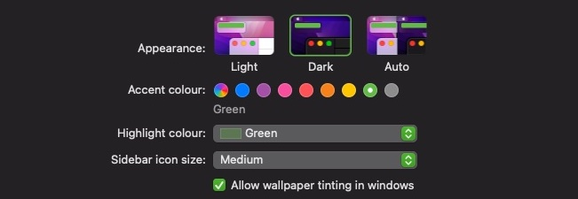

# osx-colors [](https://github.com/yuhonas/osx-colors/actions/workflows/ci.yml) 

Sane command line color customisation for osx, no more fiddling about with `defaults`, internal apple color constants and rgb color codes

Say you want to change your `Accent` and `Highlight` Color to `Green` like this




If you wanted to change it via terminal, normally you'd need to do this

```
$ defaults write -g AppleAccentColor -string 3
$ defaults write -g AppleHighlightColor -string "0.752941 0.964706 0.678431 Green"
```

Instead.... do this 😄

```
$ osx-colors set green
```

Or to set your `Accent` & `Highlight` color based on the wallpaper pallete generated from [pywal](https://github.com/dylanaraps/pywal) also requires [jq](https://github.com/stedolan/jq)

```
$ osx-colors set $(jq --raw-output '.colors.color9' < ~/.cache/wal/colors.json)
```

## Features

* Sane color handling using color names and a single command
* Provide it a color in hex and it'll find the "nearest" available apple color to it
and set it to this, this is awesome if you use [pywal](https://github.com/dylanaraps/pywal) and want matching accent/highlight colors to your wallpaper
* Restarts Finder,Docker,System Preferences etc upon setting so colors can be immediately seen

## Why

I'm a huge fan of [pywal](https://github.com/dylanaraps/pywal) and what I thought would complete the color scheme would be `Accent` & `Highlight` colors in osx that were based on the generated color palette of the wallaper, however I wasn't able to find anything that did it and color management from the commandline simply sucked, so I wrote this for my personal needs


## Limitations

* At present you can only set both the `AccentColor` and `HighlightColor` together, however the `HighlightColor`
can be customized to any color in the UI (from what I can see)
* Finding the nearest "color" isn't perfect but i've found it good enough, welcome alternative algorithms/solutions to this

## Getting Started

### Dependencies

* MacOS Monterey (It probably works on others I just haven't tested it!)
* Python 3.8 or greater

### Installing

```
pip install osx-colors
```

### Usage

To set the `Accent` and `Highlight` color to Red

```
$ osx-colors set red
Setting the 'Accent Color' to 'red'
Setting the 'Highlight Color' to 'red'
Restarting Finder, Spotlight and System Preferences, others may need to be restarted manually
```

To set the `Accent` and `Highlight` color to the closest color to the HEX color provided

```
$ osx-colors set 0029ff
Searching for the closest Apple color to '0029ff' we found 'blue'
Setting the 'Accent Color' to 'blue'
Setting the 'Highlight Color' to 'blue'
Restarting Finder, Spotlight and System Preferences, others may need to be restarted manually
```

For more usage instructions see
```
$ osx-colors --help
```

## Contributing

Feel free to lodge an issue regarding a feature request/bug report and we'll go from there!

All contributions welcome 🙂

### Running the tests

```
$ make test
```

For other build tasks see [Makefile](./Makefile)

### Versioning

We use [SemVer](http://semver.org/) for versioning. For the versions available, see the [Releases](https://github.com/yuhonas/osx-colors/releases) on this repository.


### TODO

- [ ] Ability to get colors - not sure of use case?
- [ ] Ability to set a custom `Highlight` color

## License

This project is licensed under the MIT license

## Acknowledgments

* Thanks to [ofstack](https://ofstack.com/python/11731/python-implements-a-method-to-find-the-closest-approximation-to-a-given-color-from-a-set-of-colors.html) for the code to match the "nearest" color, i'm no color scientist
* Thanks to [quantum_libet](https://www.reddit.com/r/MacOS/comments/boju0v/cant_change_accent_color_in_mojave_terminal/) on reddit for a rundown on the insanity of color management via the terminal
